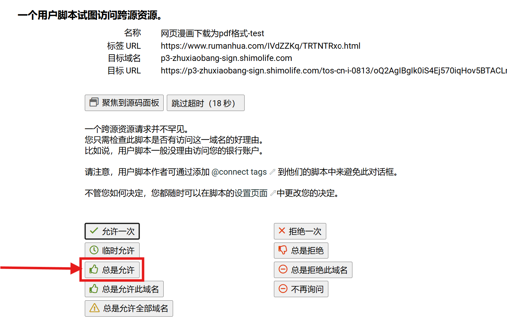

# ComicDownloader漫画下载插件

适用于[如漫画网站](http://www.rumanhua1.com/)的漫画离线下载油猴插件。插件下载地址：[下载](https://greasyfork.org/zh-CN/scripts/517511-%E7%BD%91%E9%A1%B5%E6%BC%AB%E7%94%BB%E4%B8%8B%E8%BD%BD%E4%B8%BApdf%E6%A0%BC%E5%BC%8F)

### 功能介绍

这是一个专为漫画爱好者设计的油猴脚本插件，可以将网页漫画一键下载为PDF格式，方便在各种设备上离线阅读。目前支持如漫画系列网站，未来将根据用户需求适配更多平台。您可以在[github仓库](https://github.com/duanmorningsir/ComicDownloader)中提交适配请求或反馈问题。

该插件旨在解决在线阅读的网络限制问题，让您能够将喜爱的漫画保存到本地设备，随时随地享受阅读乐趣，特别适合在电子书阅读器、平板电脑等设备上阅读。

#### 目前适配网站：

|        网站名        |           网址            | 是否适配 |      备注      |
| :------------------: | :-----------------------: | :------: | :------------: |
|   如漫画（电脑端）   | http://www.rumanhua1.com/ |    ✅     |     速度快     |
|   如漫画（手机端）   |  http://m.rumanhua1.com/  |    ✅     |  同上，手机UI  |
| 如漫画备用（电脑端） | https://www.rumanhua.org/ |    ✅     |     速度慢     |
| 如漫画备用（手机端） |  https://m.rumanhua.org/  |    ✅     |  同上，手机UI  |
|        漫蛙库        |    https://manwaku.cc/    |    ✅     | 韩漫/成人向/TL |
|      mangapark       |  https://mangapark.net/   |    ✅     |      韩漫      |

### 使用指南

#### 1. 安装本脚本，允许相关权限，否则无法下载

插件下载地址：[下载](https://greasyfork.org/zh-CN/scripts/517511-%E7%BD%91%E9%A1%B5%E6%BC%AB%E7%94%BB%E4%B8%8B%E8%BD%BD%E4%B8%BApdf%E6%A0%BC%E5%BC%8F)

*页面可能会弹出三次，记得允许！！*

*点错了选项导致无法正常下载如何操作：*

1. 重装本插件
2. 反馈给我（联络方式在最后）

#### 2. 漫画下载

##### 方式一：打开漫画目录批量下载

进入漫画的目录，例如[海贼王目录](https://www.rumanhua.org/news/500896)，点击【选择章节下载】按钮，选择要下载的章节（点击两个章节即可选择二者之间的全部章节），再点击【下载选中章节】按钮，即可批量下载，耐心等待，期间自动打开和关闭标签页属正常操作。

##### 方式二：打开漫画章节页面下载

例如[海贼王第18话 海盗“小丑巴奇”](https://www.rumanhua.org/show/xO7ABTK4ep.html)，在这个界面就是正常的阅读界面，右下角会有【下载本章节】的按钮。

#### 3. 两种下载模式说明

插件支持两种PDF生成模式，可根据个人阅读习惯选择：

**普通模式（默认）**：漫画每张图片为PDF中一页，将每页大小限制在一张A4纸大小内，尽可能填充满一块儿屏幕，适合在PDF阅读器或电脑上翻页阅读。

**滚动阅读模式**：统一整个章节的所有漫画图片的宽度，形成类似手机漫画应用的连续滚动阅读体验，适合上下滑动阅读。

切换方式：在下载界面点击"切换滚动阅读模式"/"切换普通模式"按钮即可在两种模式间切换。

### 免责声明

本插件仅用于个人学习和技术研究目的。用户应自行承担使用本插件的所有风险和责任。请注意以下几点：

1. **版权归属**：所有漫画作品的版权归原作者所有，本插件不拥有任何漫画内容的版权。
2. **合理使用**：建议用户仅下载自己已购买或有合法访问权限的漫画内容，用于个人离线阅读。
3. **禁止传播**：请勿将通过本插件下载的漫画内容上传至任何网络平台或进行商业用途。
4. **责任承担**：因使用本插件而导致的任何法律纠纷或版权问题，均由使用者自行承担全部责任。
5. **技术支持限制**：开发者不对使用本插件可能造成的任何损失承担责任，包括但不限于数据丢失、设备损坏等。

请在使用本插件时，遵守相关法律法规，尊重知识产权，合理合法使用网络资源。

### bug或改进

如果遇到bug或者想申请适配更多的网站，通过下列方式反馈
*（反馈请附上相应的漫画网址）*

- [油猴](https://greasyfork.org/zh-CN/scripts/517511-%E7%BD%91%E9%A1%B5%E6%BC%AB%E7%94%BB%E4%B8%8B%E8%BD%BD%E4%B8%BApdf%E6%A0%BC%E5%BC%8F/feedback)
- [github仓库](https://github.com/duanmorningsir/ComicDownloader)
- [QQ频道](https://github.com/user-attachments/assets/e30d6270-8448-4c61-97f9-e3ff12b37cf2)
